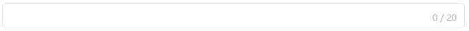

# input组件实例原理讲解

对于input组件来说，我们需要实现如下图的所有效果：




## 1. 首先`input`组件需要满足如下几点：

1. 需要对数据进行双向绑定`v-model`。

2. 可选择**`input`** 组件的类别：`input`输入框、`textarea`文本输入框。

3. 可设置组件的输入最大长度`max`。

### 1.1 根据上述内容：我们可以确定input组件中的props属性：

- text - 数据双向绑定，使用3.4最新语法`defineModel`。

- type - 选择输入框类别，input/textarea。

- max - 输入的文本最大长度。

### 1.2 代码实现

**在src/lib/input/index.vue中编写如下代码，然后使用vue3提供的`import.meta.glob`函数注册全局组件**

```Vue
<template>
  <div class=" relative leading-[0]">
    <!-- 单行 -->
    <input v-if="type === INPUT" type="text" v-model="text"
      class=" w-full py-0.5 px-1 outline-0 border border-gray-300 text-sm text-zinc-900 dark:text-zinc-500 rounded-sm focus:border-blue-400"
      :maxlength="max">
    <!-- 多行 -->
    <textarea v-if="type === TEXTAREA" v-model="text"
      class=" w-full py-0.5 px-1 outline-0 border border-gray-300 text-sm text-zinc-900 dark:text-zinc-500 rounded-sm focus:border-blue-400"
      rows="5" :maxlength="max"></textarea>
    <!-- 输入数量 -->
    <span v-if="max" class=" text-xs text-gray-400 absolute bottom-0.5 right-1"
      :class="{ ' text-red-400': currentNumber === parseInt(max) }">{{ currentNumber }} / {{ max }}</span>
  </div>
</template>

<script>
// 单行输入框
const INPUT = 'input'
// 多行输入框
const TEXTAREA = 'textarea'
</script>

<script setup>
import { computed } from 'vue'

// vue3.4新语法 替代v-model的
const text = defineModel({ required: true, type: String })
// 记录输入文本长度
const currentNumber = computed(() => text.value.length)
const props = defineProps({
  type: {
    type: String,
    default: INPUT, //默认是input
    validator(val) {
      const typeArr = [INPUT, TEXTAREA]
      const isIN = typeArr.includes(val)
      if (!isIN) {
        throw new Error(`type 必须是 ${typeArr.join('、')} 中的一种！`)
      }
      return isIN
    }
  },
  // 输入最大长度
  max: {
    type: [String, Number]
  }
})
</script>

<style lang='scss' scoped></style>

```

### 1.3 在组件中使用

```Vue
<script setup>
import { ref } from 'vue'
const text = ref('')
</script>

<template>
  <m-input v-model="text" class="w-[300px]" max="30"></m-input>
</template>

<style scoped></style>

```

- 类型是`input`，就直接使用`m-input`，其中m-是注册全局组件的时候自定义的`prefix`前缀

- 类型是`textarea`，就在组件上添加type属性，即type = 'textarea'

```Vue
...
<template>
  <m-input v-model="text" class="w-[300px]" type="textarea" max="30"></m-input>
</template>
...
```

### 1.4 要点分析

- 明确`input`组件传入的props

- 在defineProps中使用已定义的变量的时候只能重新定义`script`标签，并在其中定义变量，该变量在defineProps中使用时不会 **warning**。

- 使用 **v-if** 展示所选 **type** 组件

- 使用 **计算属性** 计算输入文本字符串的长度

- 在 **input/textarea** 上绑定 **maxlength** 属性，确保最大输入长度就是props中定义的max值

- 在 **input/textarea** 上设置宽度为父元素的 **100%**，这样我们直接可以修改 **组件m-input** 的样式来实现文本框的宽度样式

## 总结：

对于自己封装的组件而言，最重要的就是确定**传递的属性props，**然后根据传递的props进行一些逻辑的编写，其次就是css和动画，目前推荐使用TailwindCss/UnoCss,使用这两个原子化css库使用为写起来比较方便，维护起来其实也还行。
